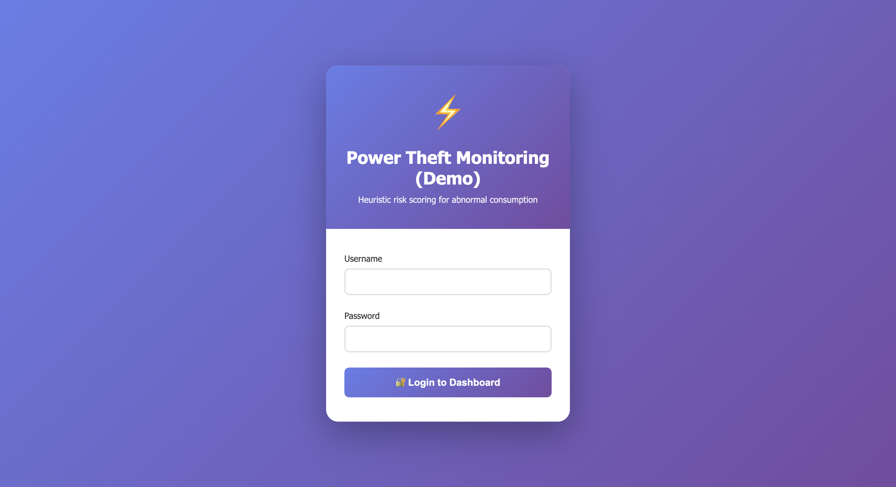
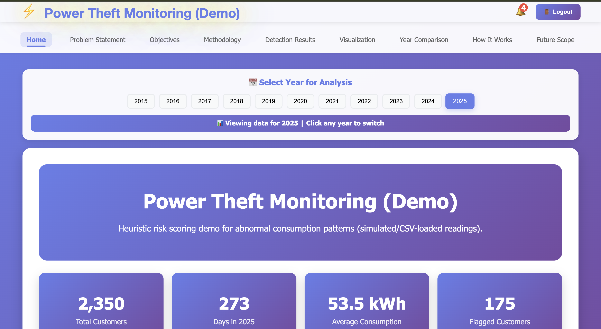
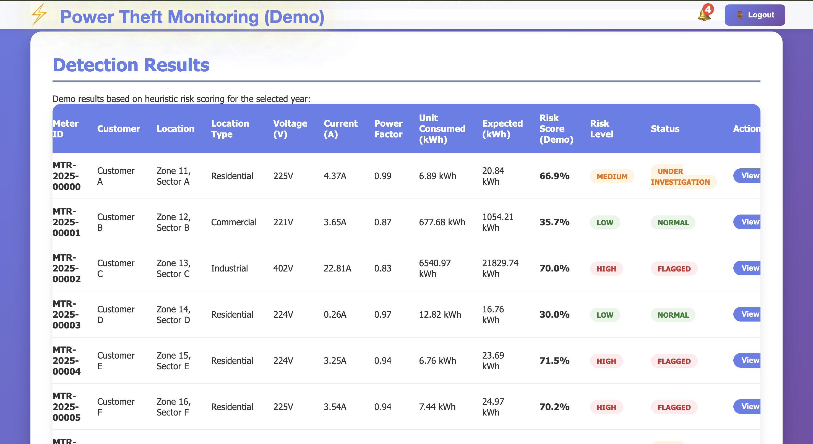
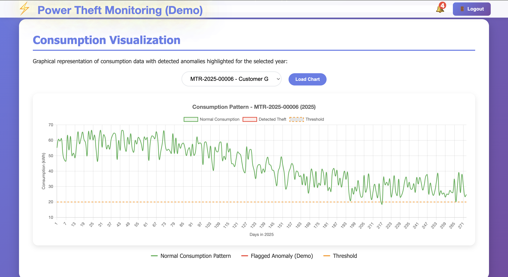
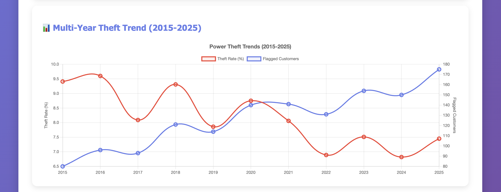
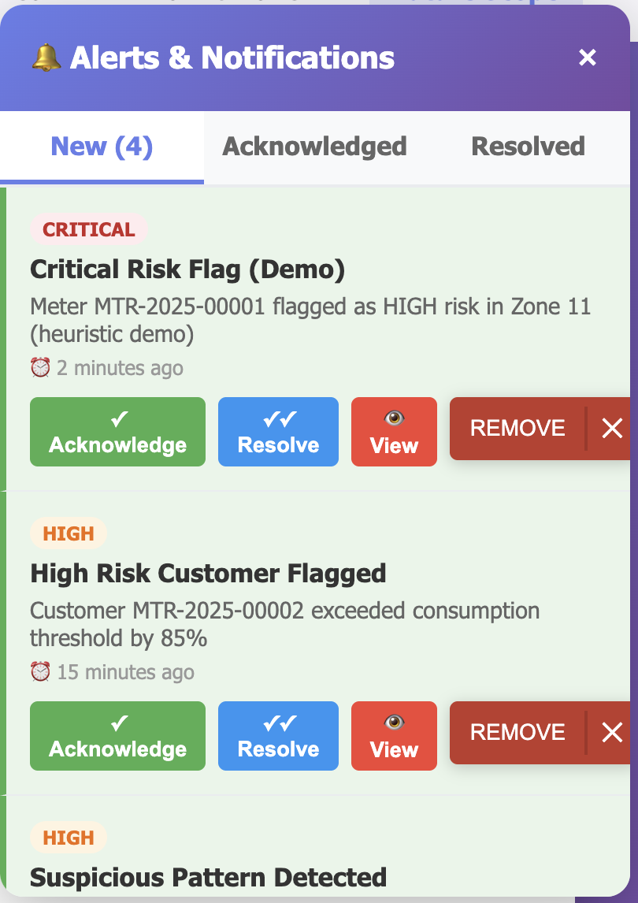
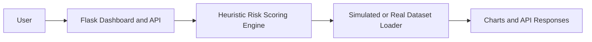

# Power Theft Investigation Prioritization Dashboard

[](https://github.com/girishk03/power-theft-detection-system/actions/workflows/ci.yml)
[](https://www.python.org/)
[](LICENSE)
[](https://power-theft-detection-system.onrender.com)

A Flask dashboard and API that demonstrate **heuristic risk scoring for electricity-theft investigation prioritization**. The running application is a research/demo workflow—not a trained theft-classification model, calibrated probability service, streaming meter platform, or production utility system.

## Project Overview

The project helps a reviewer explore consumption patterns, rank suspicious readings, and manage illustrative alerts. It provides:

- a browser dashboard with year selection, trend views, consumption charts, and detection tables;
- deterministic API responses for a poll-based simulated monitoring workflow;
- optional CSV-backed analysis for compatible daily-consumption data; and
- experimental preprocessing, model, IDS, and visualization modules that are not connected to runtime inference.

Runtime defaults to `DATA_MODE=simulated`. When `DATA_MODE=real`, the loader reads at most the first **1,000 rows** from `DATASET_PATH` to keep the demo responsive.

## Problem Statement

Utilities need to decide which unusual consumption patterns deserve investigation. This demo illustrates a transparent ranking workflow where lower-than-expected consumption receives a higher review score. The score is a rule-based signal only: it does not establish theft, replace meter validation, or automate enforcement.

## Scope

**Included**

- Simulated or CSV-backed daily consumption views
- Heuristic risk ranking and HIGH/MEDIUM/LOW labels
- Year statistics, detection rows, and consumption-series APIs
- Session login and optional API-key validation
- Browser-local alert acknowledgement and resolution

**Not included**

- Trained runtime ML inference
- Verified model-performance metrics
- Streaming meter ingestion
- Persistent alerts or investigation cases
- Utility IAM, audit trails, or production deployment guarantees

## Live Demo

[Open the dashboard](https://power-theft-detection-system.onrender.com)

- Username: `admin`
- Password: `password`

These public credentials are for the demo deployment only. Production mode requires credentials and `SECRET_KEY` to be supplied through environment variables.

## Screenshots

| Login | Dashboard Home |
|---|---|
|  |  |

| Detection Results | Consumption Chart |
|---|---|
|  |  |

| Theft Trend | Browser-local Alerts |
|---|---|
|  |  |

Screenshots show simulated dashboard states and should not be interpreted as measured utility outcomes.

## Architecture



The browser polls Flask endpoints. In simulated mode, the server generates deterministic year-based examples. In real mode, it loads a bounded CSV sample and may still substitute simulated series when data quality is insufficient.

## Dataset

The repository includes `data/raw/Electricity_Theft_Data.csv`.

| Property | Verified value |
|---|---:|
| Customer rows | 9,957 |
| Daily reading columns | 365 |
| Period | January 1–December 31, 2015 |
| Possible readings | 3,634,305 |
| Present readings | 3,140,639 |
| Missing readings | 493,666 |
| Normal labels (`CHK_STATE=0`) | 8,562 |
| Theft labels (`CHK_STATE=1`) | 1,394 |
| Missing labels | 1 |

The original source URL, dataset license, collection process, and citation requirements are **unverified** in this repository. The project MIT license covers project code and does not relicense the CSV. See [`DATASET.md`](DATASET.md) before using or redistributing the data.

`data/sample_data.csv` is a separate 96-row illustrative file with an evenly balanced synthetic-looking label distribution. It is not the dashboard's default runtime source.

## Risk Scoring Methodology

`src/risk_scoring.py` computes:

```text
raw_score = 1 - (actual_consumption / expected_consumption)
risk_score = clamp(raw_score, 0.30, 0.95)
```

Invalid readings or baselines receive a conservative fallback score of `0.80` for review.

Runtime classifications in `app.py` are:

| Level | Runtime condition | Meaning |
|---|---|---|
| HIGH | `risk_score > 0.70` | Highest review priority |
| MEDIUM | `risk_score >= 0.40` | Moderate review priority |
| LOW | `risk_score < 0.40` | Lower review priority |

Because the helper clamps scores to at least `0.30`, runtime scores normally occupy `[0.30, 0.95]`. No calibrated probability, NORMAL class, validated fraud threshold, or measured false-positive rate is claimed.

## Dashboard Functionality

- Select years from 2015–2025 for simulated timeline views.
- Load year statistics, detection examples, and daily consumption charts.
- Compare two simulated year summaries.
- View deterministic risk-ranked detection rows.
- Acknowledge, resolve, or remove sample alerts in browser memory.
- Use simulated monitoring controls driven by client-side timers.

Alert changes are not persisted and reset when the page reloads. Export/download functionality is not implemented.

## API Endpoints

| Method | Endpoint | Purpose | Authentication |
|---|---|---|---|
| GET | `/health` | Service health response | None |
| GET | `/api/available-years` | Available dashboard years | Login; API key too when configured |
| GET | `/api/year-statistics/<year>` | Simulated or CSV-backed annual summary | Login; API key too when configured |
| GET | `/api/year-consumption/<year>` | Consumption series for a selected example | Login; API key too when configured |
| GET | `/api/year-consumption/<year>/<meter_id>` | Consumption series for a meter index | Login; API key too when configured |
| GET | `/api/year-detections/<year>` | Heuristic risk-ranked detection rows | Login; API key too when configured |

Supported dashboard years are 2015–2025. Out-of-range integer years return `400`; non-integer route values return `404`.

## Authentication

The dashboard uses a simple session login. Configure:

- `SECRET_KEY`
- `ADMIN_USERNAME`
- `ADMIN_PASSWORD`

When `API_KEY` is configured, `/api/*` routes also require `X-API-KEY`. The API key does not replace the login session in the current decorator order.

## Engineering Decisions

| Challenge | Solution | Engineering Impact |
|---|---|---|
| Demonstrate utility investigation flows without a deployed model | Use a transparent, bounded heuristic score | Keeps runtime explainable and avoids presenting scores as ML probabilities |
| Keep the public demo responsive | Default to simulated data and cap real-mode loading at 1,000 rows | Predictable startup and API latency at the cost of full-dataset analysis |
| Handle incomplete consumption readings | Fall back to deterministic simulated series when quality checks fail | Dashboard remains usable, but mixed real/simulated output must be interpreted carefully |
| Protect prototype endpoints | Require a login and optionally an API key | Adds basic access control without claiming production IAM |
| Separate experiments from runtime | Keep optional ML modules under `src/` and heavy dependencies in `requirements-ml.txt` | Runtime stays lightweight; experimental modules remain explicitly non-deployed |

## Setup Guide

### Local Development

```bash
git clone https://github.com/girishk03/power-theft-detection-system.git
cd power-theft-detection-system
python3 -m venv .venv
source .venv/bin/activate
python -m pip install --upgrade pip
pip install -r requirements.txt
python app.py
```

Open `http://127.0.0.1:5000` and use the demo credentials.

### Configuration

```bash
export SECRET_KEY="replace-me"
export ADMIN_USERNAME="reviewer"
export ADMIN_PASSWORD="replace-me"
export API_KEY="optional-api-key"
export DATA_MODE="simulated"
```

### Real-Data Mode

```bash
export DATA_MODE="real"
export DATASET_PATH="data/raw/Electricity_Theft_Data.csv"
python app.py
```

Real mode loads only the first 1,000 rows. The included CSV contains 2015 columns named `DD-MM-YY`; the current loader's year-column parser expects slash-delimited dates, so the included raw file is not a complete plug-and-play source for every timeline endpoint. This mismatch is a documented limitation, not silently presented as full historical coverage.

## Docker Setup

The default image runs simulated mode and excludes datasets, screenshots, tests, and development artifacts from the build context.

```bash
docker build -t power-theft-demo .
docker run --rm -p 5000:5000 power-theft-demo
```

For real-data mode, mount an authorized dataset at runtime and set `DATASET_PATH` accordingly.

## Testing

```bash
pip install -r requirements.txt
pytest -q
```

The current suite contains 15 tests covering health, API access control, year validation, response shape, risk-score bounds, clamping, and malformed inputs.

Ruff is available locally:

```bash
ruff check .
```

## CI

GitHub Actions runs `pytest tests/ -v` on pushes to `main` and on pull requests. Ruff is not currently enforced by CI.

## Repository Structure

```text
power-theft-detection-system/
├── app.py                         # Flask dashboard and API runtime
├── src/
│   ├── risk_scoring.py            # Runtime heuristic score
│   ├── data_preprocessing.py      # Experimental preprocessing
│   ├── intrusion_detection.py     # Experimental IDS abstractions
│   ├── models.py                  # Experimental model definitions
│   └── visualization.py           # Experimental plotting helpers
├── templates/                     # Login and dashboard UI
├── data/
│   ├── raw/                       # Included unverified-source 2015 CSV
│   └── sample_data.csv            # Small illustrative sample
├── docs/screenshots/              # Dashboard screenshots
├── results/                       # Legacy claim audit and status metadata
├── tests/                         # API and risk-scoring tests
├── Dockerfile
├── Procfile
├── DATASET.md
└── LICENSE
```

## Experimental Modules

The optional modules under `src/` contain preprocessing, model definitions, IDS abstractions, and visualization helpers. They are not trained, loaded, or called by the running Flask detection endpoints. `requirements-ml.txt` installs their optional dependencies.

## Limitations

- The runtime is heuristic, not trained ML inference.
- The risk score is not a probability and has no validated operating threshold.
- Dataset source and license are unverified.
- The included raw data covers 2015 only and contains substantial missingness.
- Real mode loads at most 1,000 customers and does not provide full-dataset analytics.
- Included date-column formatting does not match the current slash-based parser.
- Simulated years, customer growth, flagged counts, and events are illustrative.
- Alert changes are browser-local and not auditable or persistent.
- No export feature, streaming ingestion, meter integration, or production IAM exists.
- Default demo credentials must not be reused outside the public demo.

## Future Improvements

- Establish and document dataset source, license, citation, and permitted uses.
- Normalize the included date schema and add real-mode integration tests.
- Add reproducible feature engineering, training, and evaluation before reporting model metrics.
- Separate real and simulated response types explicitly in API schemas.
- Persist investigations, alert transitions, reviewer identity, and audit history.
- Add dashboard browser tests, Docker smoke tests, and Ruff to CI.
- Replace demo credentials with production identity integration.
- Add streaming ingestion only after a real meter/event source is available.

## Historical Results Disclaimer

Earlier repository result files described model metrics and production readiness that cannot be reproduced from the committed files. They have been replaced with an explicit verification status under `results/`. No model files, scalers, training pipeline, predictions, or evaluation plots are included.

## License

Project code is available under the [MIT License](LICENSE). Dataset rights remain unverified and are not granted by the project license.
